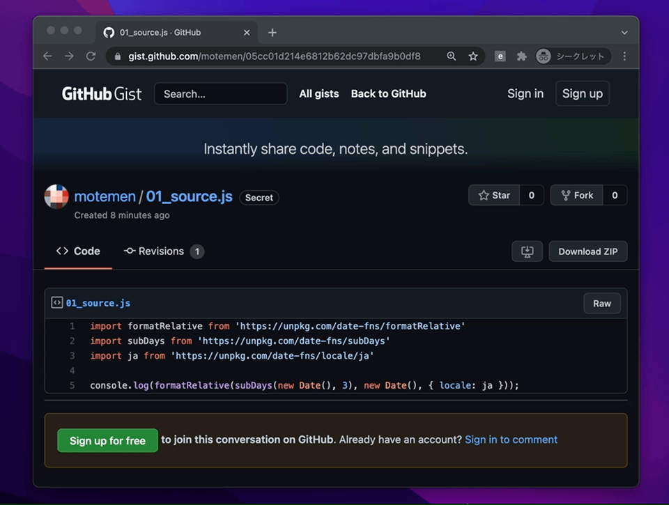

# chrome-extension-esbuild

Runs [esbuild](https://esbuild.github.io/) on devtools panel.

## Usage

Open devtools, select [esbuild] panel and click [Build].

Inspected tab's content will be import-resolved and bundled by esbuild.

## Build extension

	yarn build
